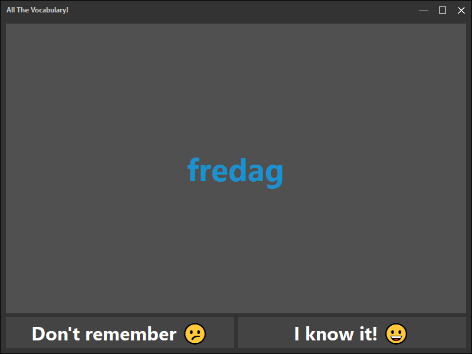

# Vocabulary Trainer

A simple CSV file based vocabulary trainer for the PC

<br><br>

# Usage
Just place CSV files into the application folder and run it.

The CSV files can be separated by: `, ; |`

## Example
```csv
Hello;Hallo
English;Englisch
```

## Hotkeys

Press `[space]` to flip the card.  
Press `[->]` to say 'I know this word'.  
Press `[<-]` to say 'I don't know this word'.